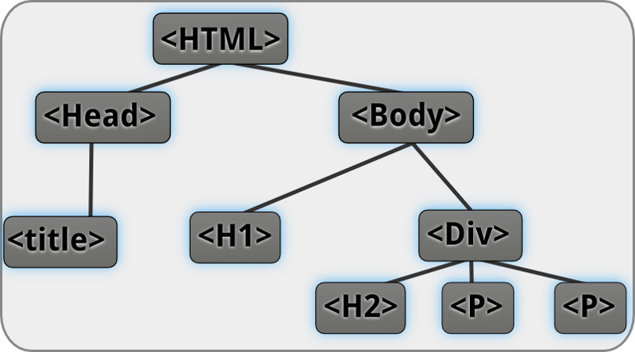
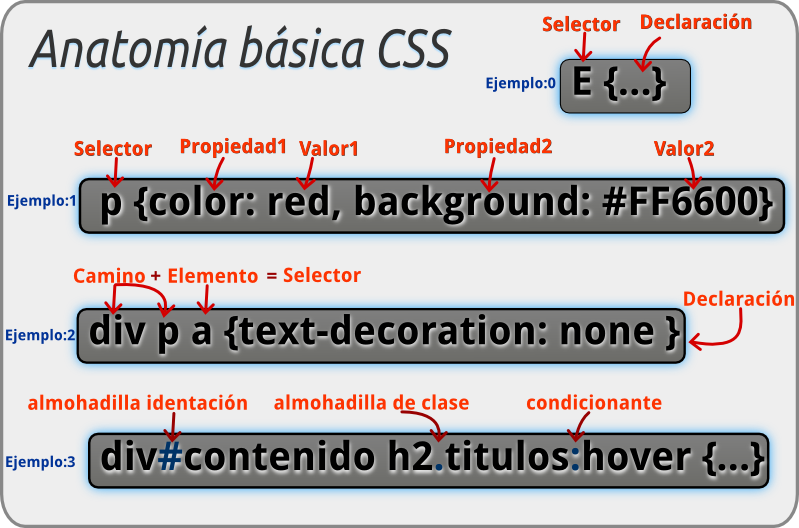
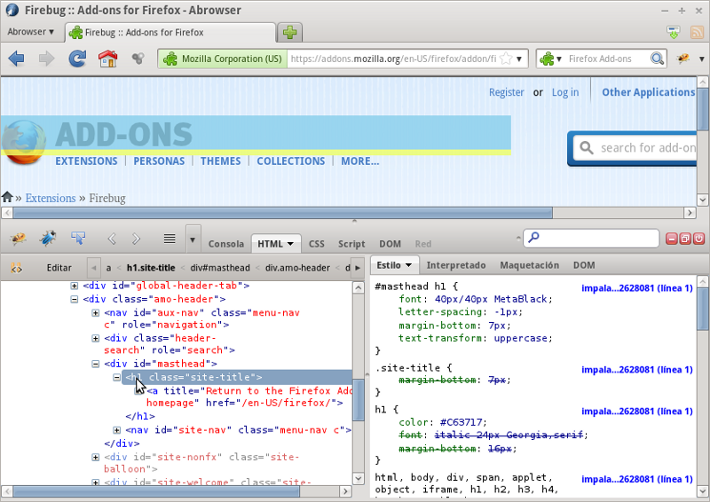
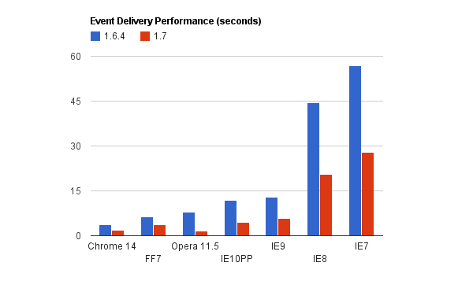

Sessión 1 - Introducción al manual
==========================================================================================

Descripción de este manual
------------------------------------------------------------------------------------------

Este es un pequeño manual _básico de **jQuery**_, el cual consta de 5 capitulos, esta diseñadado para una clase de 2 horas cada capitulo.

Este manual esta licenciado bajo [_atribución creative commons_](http://creativecommons.org/licenses/by/2.5/mx/), si desear colaborar te invito a que visites el [repositorio](https://github.com/mundoSICA/tutorial_hispano_jQuery) para que puedas ver _las instrucciones para los colaboradores_.

Breve referencia **HTML**
------------------------------------------------------------------------------------------

**HTML**, siglas de _HyperText Markup Language_ («lenguaje de marcado de hipertexto»), hace referencia al [lenguaje de marcado](http://es.wikipedia.org/wiki/Lenguaje_de_marcado) para la elaboración de páginas web. Se utiliza para describir la estructura y el contenido en forma de texto. El **HTML** se escribe en forma de «etiquetas», rodeadas por _corchetes angulares_ (`<`,`>`). **HTML** también puede describir, hasta un cierto punto, la apariencia de un documento aunque resulta una practica más recomendable incluir hojas de estilos(**CSS**) para este proposito, tambien suele incluir scripts (como [JavaScript](http://es.wikipedia.org/wiki/JavaScript)), el cual puede afectar el comportamiento de navegadores web.

> A lo largo de esta manual se usara **XHTML1.0 estricto** almenos que se diga lo contrario.

> fuente: <http://es.wikipedia.org/wiki/HTML>

### Concepto **DOM**

El _Document Object Model_ o **DOM** ('Modelo de Objetos del Documento' o 'Modelo en Objetos para la Representación de Documentos'), proporciona un conjunto estándar de objetos para representar documentos **HTML** y **XML**, un modelo estándar sobre cómo pueden combinarse dichos objetos, y una interfaz estándar para acceder a ellos y manipularlos. A través del DOM, los programas pueden acceder y modificar el contenido, estructura y estilo de los documentos **HTML** y* *XML**, que es para lo que se diseñó principalmente.

En otras parabras el DOM es una interfaz de programación de aplicaciones para acceder, añadir y cambiar dinámicamente contenido estructurado en documentos con lenguajes como ECMAScript (_JavaScript_).

> El responsable del DOM es el _World Wide Web Consortium_ ([**W3C**](http://www.w3.org/DOM/)).

Breve referencia **CSS**
------------------------------------------------------------------------------------------

_Cascading Style Sheets_ (hojas de estilo en cascada). CSS es un lenguaje usado para definir la presentación de un documento estructurado escrito en HTML o XML2 (y por extensión en XHTML). El consorcio web [W3C](http://www.w3.org/Style/CSS/) es el encargado de mantener la especificaciones.

### Anatomía CSS

La anatomía de la sintaxis de CSS es la siguiente:

Con __CSS__ podemos hacer declaraciones de estilo sobre los elementos **HTML**, para esto __CSS__ ha definido una serie de selectores.

**JQuery** hace uso de estos selectores para interactuar con el DOM, por esta razón es importante que el lector comprenda __CSS__  lamentablemente el alcance de este manual no contempla la explicación detallada de __CSS__. Sin embargo para nuestros fines nos basta con que conozcamos bien el uso de sus selectores por tal motivo he agregado una [lista de selectores css](../recursos/selectores_css.html). 

Software a usar
------------------------------------------------------------------------------------------

Para desarrollar sitios de Internet con **jQuery** basicamente necesitamos 4 cosas:

1. Editor de texto
2. Navegador web.
3. La libreria jQuery.
4. Servidor web(para la sección `ajax`, `json`).

### 1. Editor de texto:

El editor de texto es la herramienta básica para editar archivos: __HTML_, __javaScript__ y __CSS__. Hay muchos editores muy buenos y usted puede puede usar el editor de su agrado, entre los que recomendamos son los siguientes (_ordenados según mis preferencias_):

 - [Geany](http://www.geany.org/Download/Releases)
 - [Vim](http://www.vim.org/download.php)
 - [Emacs](http://www.gnu.org/software/emacs/)
 - [Kate](http://kate-editor.org/)
 - [Notepad++](http://notepad-plus-plus.org/download/v6.1.3.html)
 - [TextMate](http://kate-editor.org/)
 - [sublimeText](http://www.sublimetext.com/)

Sin embargo te recomiendo el [geany](http://www.geany.org/Download/Releases) el cual esta disponible para multiples Sistema operativos, ademas de agregarle el [geany-web-ninja](http://mundosica.github.com/geany-web-ninja/) el cual es una colección de archivos de configuración orientadas al desarrollo web. 

### 2. Navegador web:

Por cuestiones de pruebas te recomiendo que tengas todos los navegadores que esten disponibles en tu __S.O.__, sin embargo para  desarrollar/depurar te comiendo el [__firefox__](http://www.mozilla.org/en-US/firefox/all.html#es-MX) con la extensión [__firebug__](https://addons.mozilla.org/en-US/firefox/addon/firebug/?src=search).

### 3. La libreria jQuery.

**JQuery** es una libreria en constante evolución, te recomiendo usar la [libreria más reciente](http://docs.jquery.com/Downloading_jQuery), ya que en cada nueva versión se integran caracteristicas nuevas al tiempo que se mejoran las anteriores, la imagen siguiente representa una compativa en el rendimiento de <strong style='background:#36c;color:white'>jQuery 1.6.4</strong>  VS <strong style='background:#dc3912;color:white'>jQuery 1.7</strong>.

> fuente: [blog.jquery.com/2011/11/03/jquery-1-7-released](http://blog.jquery.com/2011/11/03/jquery-1-7-released/)

### 4. Servidor web.

Un servidor web es un equipo que esta en la escucha del puerto http(`80`), para nuestros fines nos es suficiente con instalar [**apache web server**](http://httpd.apache.org/), sin embargo cuando se habla de servidor web casi siempre se incluye **apache**, **php** y **msql**,si deseas tener todos estos paquetes los cuales te seran utiles a futuro te recomiendo instalar un [**xampp**](http://www.apachefriends.org/en/xampp.html) el cual esta disponible para:

 - GNU/Linux
 - Mac &copy;
 - Windows &copy;

Lecturas externas recomendables:
------------------------------------------------------------------------------------------

 - [Libro **CSS** Avanzado](http://www.librosweb.es/css_avanzado/)
 - [Secuencias de caracteres de escape __CSS__](http://mathiasbynens.be/notes/css-escapes)
 - [Como maneja _CSS_ los errores.](http://www.xanthir.com/blog/b4JF0)
